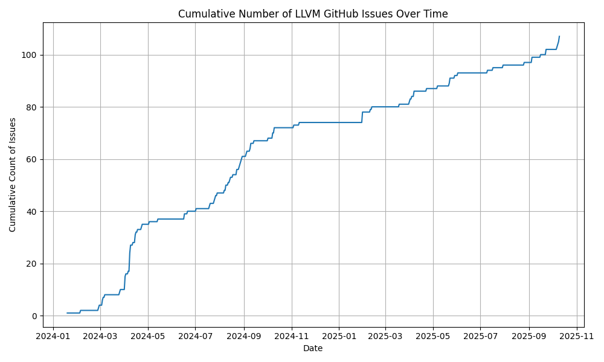

# Compiler Fuzz

# Fuzzing "stable" configs
Using csmith (a random valid c program generator) we can stress the compiler with random programs.
When we find an interesting case (ICE, execution mismatch) we can use creduce or cvise to reduce the testcase.

I (Patrick) have been doing this with success for a bit now and it has helped find issues with the riscv vector targets (and a generic issue too!)

I recommend focusing on ISA strings with "clean" testsuites (no ICEs or execution fails) since that means every new failure will be novel.

## Getting started
### Quickstart
There is a docker image if you just want to start fuzzing riscv-gcc.

Example command:
```
export RUNNER_NAME="local"
sudo docker pull ghcr.io/patrick-rivos/compiler-fuzz-ci:latest && sudo docker run -v ~/csmith-discoveries:/compiler-fuzz-ci/csmith-discoveries ghcr.io/patrick-rivos/compiler-fuzz-ci:latest sh -c "date > /compiler-fuzz-ci/csmith-discoveries/$RUNNER_NAME && nice -n 15 parallel --link \"./scripts/fuzz-qemu.sh $RUNNER_NAME-{1} {2}\" ::: $(seq 1 $(nproc) | tr '\n' ' ') ::: '-march=rv64gcv -ftree-vectorize -O3' '-march=rv64gcv_zvl256b -ftree-vectorize -O3' '-march=rv64gcv -O3' '-march=rv64gcv_zvl256b -O3' '-march=rv64gcv -ftree-vectorize -O3 -mtune=generic-ooo' '-march=rv64gcv_zvl256b -ftree-vectorize -O3 -mtune=generic-ooo' '-march=rv64gcv -O3 -mtune=generic-ooo' '-march=rv64gcv_zvl256b -O3 -mtune=generic-ooo'"
```

Command structure:
```
sudo docker pull ghcr.io/patrick-rivos/compiler-fuzz-ci:latest \   # Clone most recent container
&& sudo docker run \
-v ~/csmith-discoveries:/compiler-fuzz-ci/csmith-discoveries \     # Map the container's output directory with the user's desired output. Follows the format -v <SELECTED DIR>:<CONTAINER OUTPUT DIR>
ghcr.io/patrick-rivos/compiler-fuzz-ci:latest \                    # Run this container
sh -c "date > /compiler-fuzz-ci/csmith-discoveries/$RUNNER_NAME \  # Record the start time
&& nice -n 15 \                                                    # Run at a low priority so other tasks preempt the fuzzer
parallel --link \                                                  # Gnu parallel. Link the args so they get mapped to the core enumeration
\"./scripts/fuzz-qemu.sh $RUNNER_NAME-{1} {2}\" \                  # For each core provide a set of args
::: $(seq 1 $(nproc) | tr '\n' ' ') \                              # Enumerate cores
::: '-march=rv64gcv -ftree-vectorize -O3' '-march=rv64gcv_zvl256b -ftree-vectorize -O3' '-march=rv64gcv -O3' '-march=rv64gcv_zvl256b -O3' '-march=rv64gcv -ftree-vectorize -O3 -mtune=generic-ooo' '-march=rv64gcv_zvl256b -ftree-vectorize -O3 -mtune=generic-ooo' '-march=rv64gcv -O3 -mtune=generic-ooo' '-march=rv64gcv_zvl256b -O3 -mtune=generic-ooo'"
# ^ All the compiler flags we're interested in
```

### Build csmith:
```
git submodule update --init csmith
sudo apt install -y g++ cmake m4
mkdir csmith-build
cd csmith
cmake -DCMAKE_INSTALL_PREFIX=../csmith-build .
make && make install
```

### Build riscv-gnu-toolchain:
Bump GCC to use tip-of-tree & build:
```
git submodule update --init riscv-gnu-toolchain
cd riscv-gnu-toolchain
git submodule update --init gcc
cd gcc
git checkout master
cd ..
cd ..
mkdir build-riscv-gnu-toolchain
cd build-riscv-gnu-toolchain
../riscv-gnu-toolchain/configure --prefix=$(pwd) --with-arch=rv64gcv --with-abi=lp64d
make linux -j32
make build-qemu -j32
```

## Start fuzzing:
Update scripts compiler.path qemu.path scripts.path with the absolute paths to each of those components.

```
./scripts/fuzz-ice.sh csmith-tmp-1 "-march=rv64gcv -mabi=lp64d -ftree-vectorize -O3"
```

### Fuzz faster (& nicely!):
Running a single script is good, but if you have multiple cores (you probably do!) you can use them all!
```
parallel --lb "nice -n 15 ./fuzz-qemu.sh csmith-tmp-{} '-march=rv64gcv -mabi=lp64d -ftree-vectorize -O3'" ::: {0..$(nproc)}
```
[gnu parallel](https://www.gnu.org/software/parallel/) makes running multiple copies of a script easy.

`nice -n 15` basically tells linux "this process is low priority".
By setting this, we can leave the fuzzer going in the background and linux will automatically de-prioritize the fuzzer when more important tasks happen (like when building GCC/running a testsuite/terminal sessions/anything)

# Triaging a bug
Once you've found a bug you could submit it directly to bugzilla, but it's pretty big and can probably be reduced in size!

Here's what your bug could look like after reducing it [pr112561](https://gcc.gnu.org/bugzilla/show_bug.cgi?id=112561):
```
int printf(char *, ...);
int a, b, c, e;
short d[7][7] = {};
void main() {
  short f;
  c = 0;
  for (; c <= 6; c++) {
    e |= d[c][c] & 1;
    b &= f & 3;
  }
  printf("%X\n", a);
}
```

## Reduction steps:

1. Set up scripts directory

Fill out compiler.path, csmith.path, qemu.path, and scripts.path
[More info](./scripts/README.md).

2. Create triage directory & copy over the testcase

This will hold the initial testcase (rename it to raw.c) and the reduced testcase (red.c)

3. `cd` into the triage folder
4. Preprocess the initial testcase (raw.c)

`../scripts/preprocess.sh '<gcc-opts>'`

5. Edit `cred-ice.sh` or `cred-qemu.sh` to use the correct compilation options

Ensure the behavior is present by running the script:
`../scripts/cred-ice.sh` or `../scripts/cred-ice.sh`

This is a great time to try to reduce the command line args/ISA string. Edit compiler-opts.txt and see if removing some extensions still causes the issue to show up.

6. Reduce!

You can use creduce or cvise for this. I prefer creduce so that's what I'll use for the examples, but I use them interchangebly. I think the cli/options are the same for both.

`creduce ../scripts/cred-ice.sh red.c compiler-opts.txt`

and let it reduce!

Some helpful options:

`creduce ../scripts/cred-ice.sh red.c compiler-opts.txt --n 12` - Use 12 cores instead of the default 4

`creduce ../scripts/cred-ice.sh red.c compiler-opts.txt --sllooww` - Try harder to reduce the testcase. Typically takes longer to reduce so I'll reduce it without `--sllooww` and then use `--sllooww` after the initial reduction is done.

cvise can be run with a subset of passes. This is helpful for testcases that tend to reduce to undefined behavior.
More info can be found in [/cvise-passes](/cvise-passes/README)

# Bug trophy case:
## GCC
### Runtime fails:
1. https://gcc.gnu.org/bugzilla/show_bug.cgi?id=112801
1. https://gcc.gnu.org/bugzilla/show_bug.cgi?id=112855
1. https://gcc.gnu.org/bugzilla/show_bug.cgi?id=112929
1. https://gcc.gnu.org/bugzilla/show_bug.cgi?id=112932
1. https://gcc.gnu.org/bugzilla/show_bug.cgi?id=112988
1. https://gcc.gnu.org/bugzilla/show_bug.cgi?id=113087
1. https://gcc.gnu.org/bugzilla/show_bug.cgi?id=113206
1. https://gcc.gnu.org/bugzilla/show_bug.cgi?id=113209
1. https://gcc.gnu.org/bugzilla/show_bug.cgi?id=113281
1. https://gcc.gnu.org/bugzilla/show_bug.cgi?id=113431
1. https://gcc.gnu.org/bugzilla/show_bug.cgi?id=113607
1. https://gcc.gnu.org/bugzilla/show_bug.cgi?id=113796
1. https://gcc.gnu.org/bugzilla/show_bug.cgi?id=114027
1. https://gcc.gnu.org/bugzilla/show_bug.cgi?id=114028
1. https://gcc.gnu.org/bugzilla/show_bug.cgi?id=114200
1. https://gcc.gnu.org/bugzilla/show_bug.cgi?id=114247
1. https://gcc.gnu.org/bugzilla/show_bug.cgi?id=114396
1. https://gcc.gnu.org/bugzilla/show_bug.cgi?id=114485
1. https://gcc.gnu.org/bugzilla/show_bug.cgi?id=114665
1. https://gcc.gnu.org/bugzilla/show_bug.cgi?id=114666
1. https://gcc.gnu.org/bugzilla/show_bug.cgi?id=114668
1. https://gcc.gnu.org/bugzilla/show_bug.cgi?id=114733
1. https://gcc.gnu.org/bugzilla/show_bug.cgi?id=114734
1. https://gcc.gnu.org/bugzilla/show_bug.cgi?id=114916
1. https://gcc.gnu.org/bugzilla/show_bug.cgi?id=115336
1. https://gcc.gnu.org/bugzilla/show_bug.cgi?id=115669
1. https://gcc.gnu.org/bugzilla/show_bug.cgi?id=115703
1. https://gcc.gnu.org/bugzilla/show_bug.cgi?id=116033
1. https://gcc.gnu.org/bugzilla/show_bug.cgi?id=116035
1. https://gcc.gnu.org/bugzilla/show_bug.cgi?id=116039
1. https://gcc.gnu.org/bugzilla/show_bug.cgi?id=116059
1. https://gcc.gnu.org/bugzilla/show_bug.cgi?id=116085
1. https://gcc.gnu.org/bugzilla/show_bug.cgi?id=116149
1. https://gcc.gnu.org/bugzilla/show_bug.cgi?id=116202
1. https://gcc.gnu.org/bugzilla/show_bug.cgi?id=116278
1. https://gcc.gnu.org/bugzilla/show_bug.cgi?id=116544
1. https://gcc.gnu.org/bugzilla/show_bug.cgi?id=116715
1. https://gcc.gnu.org/bugzilla/show_bug.cgi?id=117594
1. https://gcc.gnu.org/bugzilla/show_bug.cgi?id=117682
1. https://gcc.gnu.org/bugzilla/show_bug.cgi?id=117990
1. https://gcc.gnu.org/bugzilla/show_bug.cgi?id=118075
1. https://gcc.gnu.org/bugzilla/show_bug.cgi?id=118140
1. https://gcc.gnu.org/bugzilla/show_bug.cgi?id=118154
1. https://gcc.gnu.org/bugzilla/show_bug.cgi?id=118931
1. https://gcc.gnu.org/bugzilla/show_bug.cgi?id=118950
1. https://gcc.gnu.org/bugzilla/show_bug.cgi?id=119114
1. https://gcc.gnu.org/bugzilla/show_bug.cgi?id=119115
1. https://gcc.gnu.org/bugzilla/show_bug.cgi?id=120242
1. https://gcc.gnu.org/bugzilla/show_bug.cgi?id=120297
1. https://gcc.gnu.org/bugzilla/show_bug.cgi?id=120356
1. https://gcc.gnu.org/bugzilla/show_bug.cgi?id=120522
1. https://gcc.gnu.org/bugzilla/show_bug.cgi?id=120550
1. https://gcc.gnu.org/bugzilla/show_bug.cgi?id=120688
1. https://gcc.gnu.org/bugzilla/show_bug.cgi?id=120930
1. https://gcc.gnu.org/bugzilla/show_bug.cgi?id=121126
1. https://gcc.gnu.org/bugzilla/show_bug.cgi?id=121281
1. https://gcc.gnu.org/bugzilla/show_bug.cgi?id=121592
1. https://gcc.gnu.org/bugzilla/show_bug.cgi?id=121985
1. https://gcc.gnu.org/bugzilla/show_bug.cgi?id=122844
1. https://gcc.gnu.org/bugzilla/show_bug.cgi?id=123022
1. https://gcc.gnu.org/bugzilla/show_bug.cgi?id=123097
1. https://gcc.gnu.org/bugzilla/show_bug.cgi?id=123501
1. https://gcc.gnu.org/bugzilla/show_bug.cgi?id=123626

### ICEs:
1. https://gcc.gnu.org/bugzilla/show_bug.cgi?id=112469
1. https://gcc.gnu.org/bugzilla/show_bug.cgi?id=112481
1. https://gcc.gnu.org/bugzilla/show_bug.cgi?id=112535
1. https://gcc.gnu.org/bugzilla/show_bug.cgi?id=112552
1. https://gcc.gnu.org/bugzilla/show_bug.cgi?id=112554
1. https://gcc.gnu.org/bugzilla/show_bug.cgi?id=112561
1. https://gcc.gnu.org/bugzilla/show_bug.cgi?id=112733
1. https://gcc.gnu.org/bugzilla/show_bug.cgi?id=112773
1. https://gcc.gnu.org/bugzilla/show_bug.cgi?id=112813
1. https://gcc.gnu.org/bugzilla/show_bug.cgi?id=112851
1. https://gcc.gnu.org/bugzilla/show_bug.cgi?id=112852
1. https://gcc.gnu.org/bugzilla/show_bug.cgi?id=112854
1. https://gcc.gnu.org/bugzilla/show_bug.cgi?id=112872
1. https://gcc.gnu.org/bugzilla/show_bug.cgi?id=112971
1. https://gcc.gnu.org/bugzilla/show_bug.cgi?id=113001
1. https://gcc.gnu.org/bugzilla/show_bug.cgi?id=113210
1. https://gcc.gnu.org/bugzilla/show_bug.cgi?id=113228
1. https://gcc.gnu.org/bugzilla/show_bug.cgi?id=113603
1. https://gcc.gnu.org/bugzilla/show_bug.cgi?id=114195
1. https://gcc.gnu.org/bugzilla/show_bug.cgi?id=114196
1. https://gcc.gnu.org/bugzilla/show_bug.cgi?id=114197
1. https://gcc.gnu.org/bugzilla/show_bug.cgi?id=114198
1. https://gcc.gnu.org/bugzilla/show_bug.cgi?id=114314
1. https://gcc.gnu.org/bugzilla/show_bug.cgi?id=114608
1. https://gcc.gnu.org/bugzilla/show_bug.cgi?id=114749
1. https://gcc.gnu.org/bugzilla/show_bug.cgi?id=115142
1. https://gcc.gnu.org/bugzilla/show_bug.cgi?id=115143
1. https://gcc.gnu.org/bugzilla/show_bug.cgi?id=115495
1. https://gcc.gnu.org/bugzilla/show_bug.cgi?id=115959
1. https://gcc.gnu.org/bugzilla/show_bug.cgi?id=116036
1. https://gcc.gnu.org/bugzilla/show_bug.cgi?id=116131
1. https://gcc.gnu.org/bugzilla/show_bug.cgi?id=116134
1. https://gcc.gnu.org/bugzilla/show_bug.cgi?id=116240
1. https://gcc.gnu.org/bugzilla/show_bug.cgi?id=116280
1. https://gcc.gnu.org/bugzilla/show_bug.cgi?id=116282
1. https://gcc.gnu.org/bugzilla/show_bug.cgi?id=116283
1. https://gcc.gnu.org/bugzilla/show_bug.cgi?id=116296
1. https://gcc.gnu.org/bugzilla/show_bug.cgi?id=116351
1. https://gcc.gnu.org/bugzilla/show_bug.cgi?id=116655
1. https://gcc.gnu.org/bugzilla/show_bug.cgi?id=116720
1. https://gcc.gnu.org/bugzilla/show_bug.cgi?id=117506
1. https://gcc.gnu.org/bugzilla/show_bug.cgi?id=117567
1. https://gcc.gnu.org/bugzilla/show_bug.cgi?id=118084
1. https://gcc.gnu.org/bugzilla/show_bug.cgi?id=120137
1. https://gcc.gnu.org/bugzilla/show_bug.cgi?id=120143
1. https://gcc.gnu.org/bugzilla/show_bug.cgi?id=120357
1. https://gcc.gnu.org/bugzilla/show_bug.cgi?id=120652
1. https://gcc.gnu.org/bugzilla/show_bug.cgi?id=120922
1. https://gcc.gnu.org/bugzilla/show_bug.cgi?id=121072
1. https://gcc.gnu.org/bugzilla/show_bug.cgi?id=121073
1. https://gcc.gnu.org/bugzilla/show_bug.cgi?id=121075
1. https://gcc.gnu.org/bugzilla/show_bug.cgi?id=121659
1. https://gcc.gnu.org/bugzilla/show_bug.cgi?id=121695
1. https://gcc.gnu.org/bugzilla/show_bug.cgi?id=122474
1. https://gcc.gnu.org/bugzilla/show_bug.cgi?id=122475

### Other:
1. https://gcc.gnu.org/bugzilla/show_bug.cgi?id=114261
1. https://gcc.gnu.org/bugzilla/show_bug.cgi?id=114671


### Bugs filed over time:

## LLVM
### Runtime fails:
1. [78783: RISCV64 miscompile at -O1](https://github.com/llvm/llvm-project/issues/78783)
1. [80744: RISCV64 backend "Invalid size request on a scalable vector"](https://github.com/llvm/llvm-project/issues/80744)
1. [83354: [InstCombine] Infinite loop/hang](https://github.com/llvm/llvm-project/issues/83354)
1. [83469: [Pass Manager] Excessive scheduled passes](https://github.com/llvm/llvm-project/issues/83469)
1. [84350: [RISC-V] Miscompile at -O2](https://github.com/llvm/llvm-project/issues/84350)
1. [86620: [RISC-V] Vector -flto -O2 miscompile](https://github.com/llvm/llvm-project/issues/86620)
1. [86763: [RISC-V][SLP] Sign extension miscompile](https://github.com/llvm/llvm-project/issues/86763)
1. [88079: [RISC-V] Unresolvable relocation with `-fdirect-access-external-data -fstack-protector-all`](https://github.com/llvm/llvm-project/issues/88079)
1. [88834: [RISC-V][SLPVectorizer] rv64gcv miscompile ](https://github.com/llvm/llvm-project/issues/88834)
1. [89833: [RISC-V] rv64gcv miscompile with pass `--riscv-gather-scatter-lowering`](https://github.com/llvm/llvm-project/issues/89833)
1. [89988: [SLPVectorizer][RISC-V] rv64gcv miscompile with `slp-vectorizer` pass](https://github.com/llvm/llvm-project/issues/89988)
1. [91025: [SLPVectorizer] Miscompile with rv64gcv -O3](https://github.com/llvm/llvm-project/issues/91025)
1. [92193: [DAGCombine][RISC-V] VSelect miscompile at -O1](https://github.com/llvm/llvm-project/issues/92193)
1. [99729: [RISC-V] Miscompile with -march=rv64gcv_zvl1024b -O2](https://github.com/llvm/llvm-project/issues/99729)
1. [107891: [RISC-V] Miscompile with RISC-V Vector Peephole Optimization](https://github.com/llvm/llvm-project/issues/107891)
1. [111458: [RISC-V] Miscompile with `-flto`](https://github.com/llvm/llvm-project/issues/111458)
1. [111555: [RISC-V] Miscompile at -O3](https://github.com/llvm/llvm-project/issues/111555)
1. [126974: [RISC-V] Miscompile using rv64gcv](https://github.com/llvm/llvm-project/issues/126974)
1. [132071: [RISC-V] Miscompile on rv64gcv with -O[23]](https://github.com/llvm/llvm-project/issues/132071)
1. [133943: [RISC-V] Miscompile on rv64gcv with -O[23]](https://github.com/llvm/llvm-project/issues/133943)
1. [134126: [RISC-V] Miscompile on rv64gcv with -O3](https://github.com/llvm/llvm-project/issues/134126)
1. [134705: [RISC-V] Miscompile in rv64gcv with -O3 -flto](https://github.com/llvm/llvm-project/issues/134705)
1. [138923: [RISC-V] Miscompile on rv64gcv with -O[23]](https://github.com/llvm/llvm-project/issues/138923)
1. [141098: [RISC-V] Miscompile on -O3 with -flto](https://github.com/llvm/llvm-project/issues/141098)
1. [142004: [RISC-V] Miscompile on -O[1-3]](https://github.com/llvm/llvm-project/issues/142004)
1. [149335: [RISC-V] Miscompile at -O[23]](https://github.com/llvm/llvm-project/issues/149335)
1. [154103: [riscv64] [LoopVectorize] Assertion Failure in computeBestVF with VPlan Cost Model](https://github.com/llvm/llvm-project/issues/154103)
1. [159152: [RISC-V] Miscompile at -O3 with -flto](https://github.com/llvm/llvm-project/issues/159152)
1. [162512: [RISC-V][LV] Miscompile at -O3](https://github.com/llvm/llvm-project/issues/162512)
1. [171994: [LLVM] [RISC-V] [ICE] Assertion Failure at llvm/lib/CodeGen/LiveInterval.cpp:391: bool llvm::LiveRange::overlapsFrom(...)](https://github.com/llvm/llvm-project/issues/171994)

### ICEs:
1. [83920: [DAGCombiner][RISC-V] DAGCombiner.cpp:8692: Assertion `Index < ByteWidth && "invalid index requested"' failed.](https://github.com/llvm/llvm-project/issues/83920)
1. [83929: [RISC-V] Segfault during pass 'RISC-V DAG->DAG Pattern Instruction Selection'](https://github.com/llvm/llvm-project/issues/83929)
1. [83931: [InstCombine][RISC-V] UNREACHABLE executed at InstCombineCompares.cpp:2788](https://github.com/llvm/llvm-project/issues/83931)
1. [87378: [LoopVectorize] Assertion `OpType == OperationType::DisjointOp && "recipe cannot have a disjoing flag"' failed.](https://github.com/llvm/llvm-project/issues/87378)
1. [87384: [SLP] Attempted invalid cast from `VectorType` to `FixedVectorType`](https://github.com/llvm/llvm-project/issues/87384)
1. [87394: [LoopVectorize][VPlan] Unreachable executed "Unhandled opcode!"](https://github.com/llvm/llvm-project/issues/87394)
1. [87407: [LoopVectorize][VPlan] Assertion `MinBWs.size() == NumProcessedRecipes && "some entries in MinBWs haven't been processed"' failed.](https://github.com/llvm/llvm-project/issues/87407)
1. [87410: [LoopVectorize][VPlan] Assertion "Trying to access a single scalar per part but has multiple scalars per part." failed.](https://github.com/llvm/llvm-project/issues/87410)
1. [87441: [Inline] Assert getOperand() out of range! failed.](https://github.com/llvm/llvm-project/issues/87441)
1. [87852: [Clang] Assertion isCurrentFileAST() && "dumping non-AST?" failed. with `-module-file-info`](https://github.com/llvm/llvm-project/issues/87852)
1. [88018: [Clang][Interp] Assertion 'Offset + sizeof(T) <= Pointee->getDescriptor()->getAllocSize()' failed. with `-fexperimental-new-constant-interpreter`](https://github.com/llvm/llvm-project/issues/88018)
1. [88038: [Clang] Segfault with `-fcoverage-mapping -fcs-profile-generate -fprofile-instr-generate`](https://github.com/llvm/llvm-project/issues/88038)
1. [88041: [X86][RISC-V][AARCH64] fatal error: error in backend: Can only embed the module once with `-fembed-bitcode -ffat-lto-objects -flto`](https://github.com/llvm/llvm-project/issues/88041)
1. [88046: [RISC-V] Unhandled encodeInstruction length! at RISCVMCCodeEmitter.cpp:338 with `-fglobal-isel -fstack-protector-all`](https://github.com/llvm/llvm-project/issues/88046)
1. [88057: [RISC-V] LLVM ERROR: unable to legalize instruction with `-fglobal-isel -finstrument-functions -flto -fuse-ld=lld`](https://github.com/llvm/llvm-project/issues/88057)
1. [88058: [X86] LLVM ERROR: cannot select with `-fglobal-isel -finstrument-functions -flto`](https://github.com/llvm/llvm-project/issues/88058)
1. [88061: [LLD] Unreachable executed with `-fsplit-stack`](https://github.com/llvm/llvm-project/issues/88061)
1. [88153: [Clang] Assertion 'Symbol' failed. with `-fdebug-macro -gline-directives-only`](https://github.com/llvm/llvm-project/issues/88153)
1. [88208: [CodeGen] Assertion 'Offset >= Size' failed. with `-mms-bitfields`](https://github.com/llvm/llvm-project/issues/88208)
1. [88576: [RISC-V] Error in backend: Invalid size request on a scalable vector.](https://github.com/llvm/llvm-project/issues/88576)
1. [88796: [VectorCombine] Assertion 'isa<To>(Val) && "cast<Ty>() argument of incompatible type!"' failed.](https://github.com/llvm/llvm-project/issues/88796)
1. [88799: [CodeGen][RISC-V] Assertion `(!MMO->getSize().hasValue() || !getSize().hasValue() || MMO->getSize() == getSize()) && "Size mismatch!"' failed.](https://github.com/llvm/llvm-project/issues/88799)
1. [88804: [LoopVectorize][VPlan] Found non-header PHI recipe in header - Assertion `verifyVPlanIsValid(*Plan) && "VPlan is invalid"' failed.](https://github.com/llvm/llvm-project/issues/88804)
1. [89285: [CodeGen][RISC-V] Assertion '(FrameSDOps.empty() || MF.getFrameInfo().adjustsStack()) && "AdjustsStack not set in presence of a frame pseudo instruction."' failed.](https://github.com/llvm/llvm-project/issues/89285)
1. [95865: [RISC-V] Assertion '!mi2iMap.contains(&MI) && "Instr already indexed."' failed](https://github.com/llvm/llvm-project/issues/95865)
1. [95870: [RISC-V] Assertion: 'AdjustsStack not set in presence of a frame pseudo instruction.' at -O1 with -fwrapv](https://github.com/llvm/llvm-project/issues/95870)
1. [96328: [LoopVectorize][VPlan] Assertion `VF.Width == Width && "VPlan cost model and legacy cost model disagreed"' failed.](https://github.com/llvm/llvm-project/issues/96328)
1. [97452: [LoopVectorize] Assertion `Offset <= State.VF.getKnownMinValue() && "invalid offset to extract from"' failed.](https://github.com/llvm/llvm-project/issues/97452)
1. [99701: [VPlan] Assertion `VF.Width == Width && "VPlan cost model and legacy cost model disagreed"' failed.](https://github.com/llvm/llvm-project/issues/99701)
1. [100591: [VPlan] Assertion `VF.Width == Width && "VPlan cost model and legacy cost model disagreed"' failed.](https://github.com/llvm/llvm-project/issues/100591)
1. [100822: [RISC-V] Assertion "FP not reserved" failed with -mabi=lp64e and -mabi=ilp32e](https://github.com/llvm/llvm-project/issues/100822)
1. [100855: [RISC-V] `Cannot select: t32: i32 = RISCVISD::CZERO_EQZ t25, t4` with xventanacondops](https://github.com/llvm/llvm-project/issues/100855)
1. [101067: [RISC-V] Cannot select `t21: i64,ch = store<(store (s32) into %ir.a), trunc to i32, <post-inc>> t0, Constant:i64<0>, t2, t10` with xcvmem and zimop](https://github.com/llvm/llvm-project/issues/101067)
1. [102352: [RISC-V] zve32*: Assertion `RISCVTargetLowering::getRegClassIDForVecVT(SubVecContainerVT) == InRegClassID && "Unexpected subvector extraction"' failed.](https://github.com/llvm/llvm-project/issues/102352)
1. [102566: [RISC-V] Assertion `MemVT.getScalarType().bitsLT(VT.getScalarType()) && "Should only be an extending load, not truncating!"' failed.](https://github.com/llvm/llvm-project/issues/102566)
1. [102568: [RISC-V] Assertion `NVT.bitsGE(VT)' failed.](https://github.com/llvm/llvm-project/issues/102568)
1. [102934: [LoopVectorize] Assertion `WideningDecision != CM_Unknown && "Widening decision should be ready at this moment"' failed.](https://github.com/llvm/llvm-project/issues/102934)
1. [104048: [SLP Vectorizer] Assertion `VecTy.SimpleTy != MVT::INVALID_SIMPLE_VALUE_TYPE && "Simple vector VT not representable by simple integer vector VT!"' failed.](https://github.com/llvm/llvm-project/issues/104048)
1. [104480: [RISC-V] PromoteIntegerResult mulhs Do not know how to promote this operator!](https://github.com/llvm/llvm-project/issues/104480)
1. [104714: [VPlan] Assertion `VF.Width == BestVF && "VPlan cost model and legacy cost model disagreed"' failed.](https://github.com/llvm/llvm-project/issues/104714)
1. [105894: [RISC-V] Assertion `isa<To>(Val) && "cast<Ty>() argument of incompatible type!"' failed.](https://github.com/llvm/llvm-project/issues/105894)
1. [105904: [SLP Vectorizer] Assertion `!empty()' failed.](https://github.com/llvm/llvm-project/issues/105904)
1. [106126: [SLP Vectorizer] Assertion `I >= 0 && I < (NumOpElts * 2) && "Out-of-bounds shuffle mask element"' failed.](https://github.com/llvm/llvm-project/issues/106126)
1. [106257: [LoopVectorize] Assertion `(GeneratedValue->getType()->isVectorTy() == !GeneratesPerFirstLaneOnly || State.VF.isScalar()) && "scalar value but not only first lane defined"' failed.](https://github.com/llvm/llvm-project/issues/106257)
1. [106417: [VPlan] Assertion " VPlan cost model and legacy cost model disagreed"' failed.](https://github.com/llvm/llvm-project/issues/106417)
1. [106641: [VPlan] Assertion " VPlan cost model and legacy cost model disagreed"' failed.](https://github.com/llvm/llvm-project/issues/106641)
1. [106780: [VPlan] Assertion " VPlan cost model and legacy cost model disagreed"' failed.](https://github.com/llvm/llvm-project/issues/106780)
1. [107171: [VPlan] Assertion " VPlan cost model and legacy cost model disagreed"' failed.](https://github.com/llvm/llvm-project/issues/107171)
1. [107473: [VPlan] Assertion " VPlan cost model and legacy cost model disagreed"' failed.](https://github.com/llvm/llvm-project/issues/107473)
1. [107950: [RISC-V] Assertion `TrueV0Def && TrueV0Def->isCopy() && MIV0Def && MIV0Def->isCopy()' failed.](https://github.com/llvm/llvm-project/issues/107950)
1. [108098: [VPlan] Assertion " VPlan cost model and legacy cost model disagreed"' failed.](https://github.com/llvm/llvm-project/issues/108098)
1. [108708: [RISC-V][LoopUnroll] Segfault in `llvm::TargetLoweringBase::getTypeConversion`](https://github.com/llvm/llvm-project/issues/108708)
1. [110931: [RISC-V] Assertion `MO.getParent()->getParent() == Src.getParent()' failed.](https://github.com/llvm/llvm-project/issues/110931)
1. [111881: [RISCV] Assertion `A.valno == B.valno && "Cannot overlap different values"' failed.](https://github.com/llvm/llvm-project/issues/111881)
1. [111887: [SLP-Vectorizer] Segfault in `HorizontalReduction::matchAssociativeReduction`](https://github.com/llvm/llvm-project/issues/111887)
1. [114860: [VPlan] Assertion " VPlan cost model and legacy cost model disagreed"' failed.](https://github.com/llvm/llvm-project/issues/114860)
1. [115744: [VPlan] Assertion "VPlan cost model and legacy cost model disagreed"' failed.](https://github.com/llvm/llvm-project/issues/115744)
1. [125269: [RISC-V]  Assertion `Idx2 != UINT_MAX && Values.contains(Idx2) && "Expected both indices to be extracted already."' failed](https://github.com/llvm/llvm-project/issues/125269)
1. [125274: [LoopVectorize] Assertion `all_of(I->users(), [&InsertedSet](Value *U) { return InsertedSet.contains(cast<Instruction>(U)); }) && "removed instruction should only be used by instructions inserted " "during expansion"' failed.](https://github.com/llvm/llvm-project/issues/125274)
1. [125278: [LoopVectorize] Assertion `MinBWs.size() == NumProcessedRecipes && "some entries in MinBWs haven't been processed"' failed.](https://github.com/llvm/llvm-project/issues/125278)
1. [125306: [RISC-V] LLVM ERROR: Invalid size request on a scalable vector](https://github.com/llvm/llvm-project/issues/125306)
1. [126581: [SLPVectorizer] Segmentation Fault using opt "-passes=lto<O3>"](https://github.com/llvm/llvm-project/issues/126581)
1. [134424: [RISC-V] RegisterCoalescer: Assertion `A.valno == B.valno && "Cannot overlap different values"' failed.](https://github.com/llvm/llvm-project/issues/134424)
1. [134696: [LoopVectorize] Assertion `isPowerOf2_32(End.getKnownMinValue()) && "Expected End to be a power of 2"' failed.](https://github.com/llvm/llvm-project/issues/134696)
1. [137024: [LoopVectorizer] Assertion `hasKnownScalarFactor(RHS) && "Expected RHS to be a known factor!"' failed.](https://github.com/llvm/llvm-project/issues/137024)
1. [141262: [RISC-V] Assertion `L.isLCSSAForm(DT)' failed.](https://github.com/llvm/llvm-project/issues/141262)
1. [141265: [SLPVectorizer] Instruction does not dominate all uses!](https://github.com/llvm/llvm-project/issues/141265)
1. [142447: [InstCombine] ICmp i1 X, C not simplified as expected. with opt "-passes=lto<O3>"](https://github.com/llvm/llvm-project/issues/142447)
1. [147986: [RISC-V] Assertion `From.getParent() == To.getParent() && !From.hasImplicitDef()' failed.](https://github.com/llvm/llvm-project/issues/147986)
1. [151392: [LoopVectorize] Assertion `State.TypeAnalysis.inferScalarType(RepRecipe) == Cloned->getType() && "inferred type and type from generated instructions do not match"' failed.](https://github.com/llvm/llvm-project/issues/151392)
1. [155512: [SLPVectorizer] Assertion `(I->use_empty() || all_of(I->uses(), [&](Use &U) { return isDeleted( cast<Instruction>(U.getUser())); })) && "trying to erase instruction with users."' failed.](https://github.com/llvm/llvm-project/issues/155512)
1. [157177: [RISC-V] Assertion `isSimple() && "Expected a SimpleValueType!"' failed.](https://github.com/llvm/llvm-project/issues/157177)
1. [157184: Assertion `OldMaskParam && "no mask param to fold the vl param into"' failed](https://github.com/llvm/llvm-project/issues/157184)
1. [158121: [LLVM][RISCV][ICE] Compiler crash at Assertion Failure at (!From->hasAnyUseOfValue(i) ||, file SelectionDAG.cpp:12171 since a652979b483da6e5a45ebf6428be408de66ac857](https://github.com/llvm/llvm-project/issues/158121)
1. [160393: [RISC-V] Assertion `VT.getVectorElementType() == N1VT.getVectorElementType() && "Extract subvector VTs must have the same element type!"' failed.](https://github.com/llvm/llvm-project/issues/160393)
1. [160396: [LoopVectorize] Assertion `OpType == Other.OpType && "OpType must match"' failed.](https://github.com/llvm/llvm-project/issues/160396)
1. [162374: [LoopVectorize] Assertion `OpType == Other.OpType && "OpType must match"' failed.](https://github.com/llvm/llvm-project/issues/162374)
1. [162688: [LoopVectorize]  Assertion `(BestFactor.Width == LegacyVF.Width || BestPlan.hasEarlyExit() || ... && " VPlan cost model and legacy cost model disagreed"' failed.](https://github.com/llvm/llvm-project/issues/162688)
1. [162922: [RISC-V][LoopVectorize] Assertion `hasUseList()' failed.](https://github.com/llvm/llvm-project/issues/162922)
1. [162925: [RISC-V][SLPVectorizer] Assertion `all_of(Bundles, [](const ScheduleBundle *Bundle) { return Bundle->isScheduled(); }) && "must be scheduled at this point"' failed.](https://github.com/llvm/llvm-project/issues/162925)
1. [169948: [LLVM][RISCV][ICE] LoopVectorize Assertion Failure in computeBestVF()](https://github.com/llvm/llvm-project/issues/169948)


### Bugs filed over time:


# Contribute
Have an improvement? PRs are welcome!
